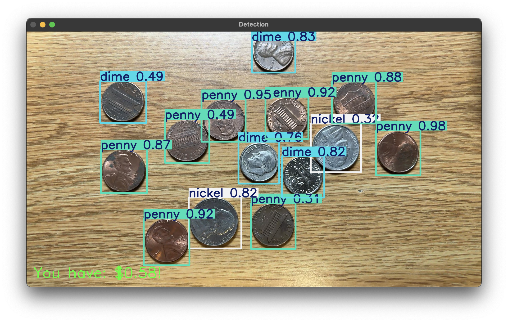

# coinDemo ₿

### **Fully trained 🏋 in KeypointDemo/TestwithCoindemo**

## Feature
- 📊 Personlized dataset
- 🪙 Detect US coins
- 💰 Deployed to show your totoal money

## Visualization 🕶️


## In work
- Too few quarter pics in dataset => poor behavior in detecting quarters

## Clone this projsct
```
  git clone https://github.com/Adamy8/coinDemo.git
```
